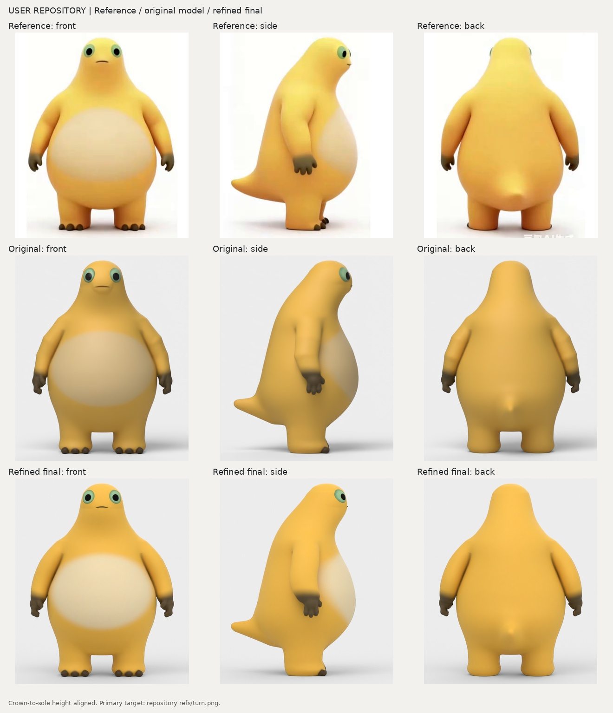

# 奶娃 Blender 模型：三视图精修与捧腹大笑

本轮基于 `nullcache/claude-demo` 的 `claude/nailong-meme-video-yut5t3` 分支继续修改，底稿提交为 `c5058ef43b7a72b9c69596552aa9cf0d9a5643aa`。

`naiwa.blend` 是精修后的常态站姿。`naiwa_rigged.blend` 是可选的动画工程，包含 `Idle` 和 `Laugh_Belly`。两份工程都保留摄影棚和相机，打开后按 F12 可渲染；制作版本为 Blender 4.5.14 LTS。

本轮状态见 [PROGRESS.md](PROGRESS.md)。三视图对照的三行依次为：参考图、仓库原模型、精修模型。



## 本轮精修

优先对照 `refs/turn.png` 的正、侧、背三视图，单独的 `refs/front.png` 作为补充参考。三视图源图标注 AI 生成，部分受光、尾根和不同视角的细节并不完全一致，不能据此宣称逐点一比一。

- 眼睛改成贴脸浅球冠，降低反光；按参考调整眼圈可见宽度、黑瞳大小和间距。
- 常态嘴上移约身高的 1%，缩窄约 10%，减弱原嘴套的圆托阴影。
- 手臂用连续曲线放样，消除原直线锥台在肘部的折角；按三视图调正面外缘、侧面厚度和贴身折缝。
- 腹部浅色斑过渡更柔和，增加均匀补光以接近三视图的受光；尾巴下缘靠身体的一端稍上抬。
- 所有脚底统一截平，避免腿和脚趾穿过采样体积下界造成开口。

身体厚度、头部前探和尾长继续使用仓库原有的测量轮廓。剪影重合度只反映外轮廓，不能代表五官、材质或体积已完全相同。

## 工程与脚本

| 文件 | 作用 |
| --- | --- |
| `naiwa.blend` | 常态精修工程，约 20 万面 |
| `naiwa_rigged.blend` | 独立手臂动画工程，躯干和双臂约 30 万面，Idle / Laugh_Belly |
| `shape.py` | 原有身体、腿、尾及测量参数；可一次生成三个动画组件体积 |
| `arm_curve.py` | 保留肩/肘/腕控制点的连续曲线手臂 |
| `build.py` | 网格、颜色遮罩、眼睛、常态嘴线、摄影棚 |
| `component_meshes.py` | 生成闭合躯干和独立双臂，避免抬手拉扯侧腹 |
| `mouth_safe.py` | 仅重建局部口唇、真实口腔、牙齿、舌头及大笑形态键 |
| `animation_safe.py` | 新骨架、表情驱动和动作 |
| `make.py` | 一键生成常态或 `--rig` 动画工程 |
| `compare.py` | 统一用三视图源图进行正/侧/背渲染对照 |
| `silhouette.py` | 剪影比对工具，原单正面帧的度量仍可作为辅助 |
| `previews.py` | 转台和动作预览渲染工具 |
| `rig.py` / `actions.py` | 旧版骨架和动作，保留但不再接入新生成流程 |

## 重新生成

`bpy==4.5.14` 的 wheel 需要 **Python 3.11**。使用其他 Python 小版本会出现找不到匹配版本的错误。

```bash
python3.11 -m venv venv
venv/bin/pip install -r blender/naiwa/requirements.txt
venv/bin/python blender/naiwa/make.py --out blender/naiwa
venv/bin/python blender/naiwa/make.py --rig --out blender/naiwa
venv/bin/python blender/naiwa/compare.py blender/naiwa/naiwa.blend out/naiwa-cmp
```

`--voxel` 默认 0.003；`--faces` 默认 200000。静态版是全身预算，动画版是躯干预算，两条手臂各另加约四分之一预算；嘴部另有局部拓扑。增加网格密度并不自动提高相似度，外形仍由测量参数决定。Linux 下可设置 `OPENBLAS_NUM_THREADS=1 OMP_NUM_THREADS=1`，避免小批次距离场计算使用过多线程。

只生成工程时不需要重新抠图，`rembg[cpu]` 是可选工具。要重新生成遮罩时才安装它。

## 播放或调整动作

打开 `naiwa_rigged.blend`，选择 `Naiwa_SafeRig`，在 Dope Sheet 的 Action Editor 中选择 `Idle` 或 `Laugh_Belly`，空格播放。大笑动作长 120 帧，24 帧/秒，包含双手移向腹部、俯仰、张嘴和眯眼。

骨架自定义属性 `laugh` 范围为 0～1。手动调整前先解除当前动作关联，避免关键帧覆盖属性值。Pose Mode 可调整四肢、身体、头和尾巴；手指随手掌骨运动，没有独立每指控制器。

动画版的双臂独立于躯干，并只在臂根与肩部相交。嘴部仅替换前脸的局部网格，其余部位沿用同一套形体参数。

如已安装 `ffmpeg`，可用 `previews.py naiwa_rigged.blend out/preview --only Laugh_Belly` 导出动作视频。
